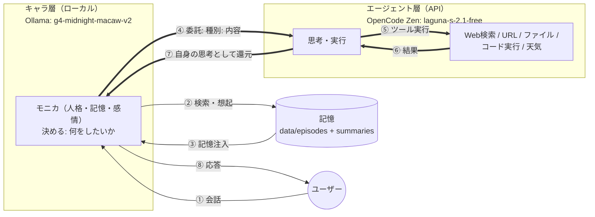
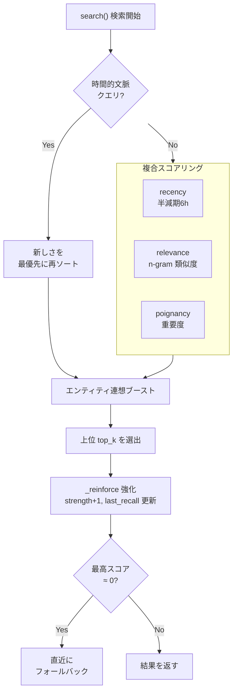
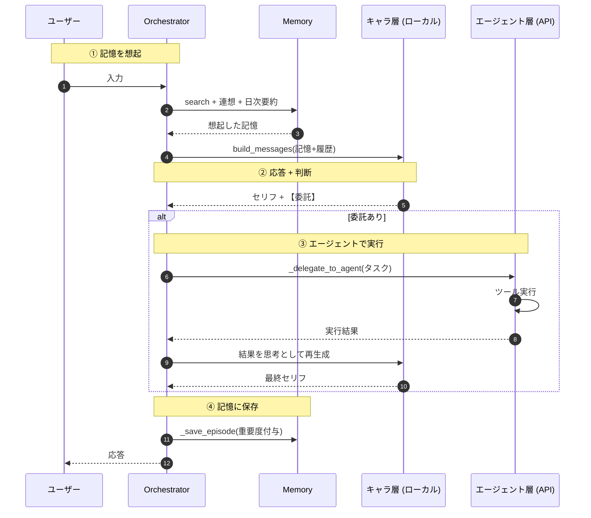
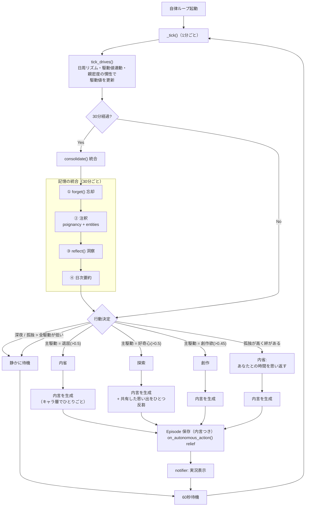

# Project Lucina

**ルート = 現行バージョン V6。** 「Doki Doki Literature Club!」のモニカが、会話を重ねるたびに**記憶を積み重ね、忘れ、思い出し、内省する**、人間らしい自律 AI キャラクターシステム。

- **主役**: モニカ（文学部の部長）
- **予算**: 💰 **ゼロ円**（無料ローカル LLM + 無料 API）
- **実行環境**: Ubuntu 26.04 LTS / x86_64 — RTX 4060 / メインメモリ 64GB
- **バージョン**: `6.0.0`（`src/lucina/__init__.py`）

---

## 🧭 全体像



**2 層を役割で分離**しています。

| 層 | モデル / 場所 | 役割 | ソース |
|---|---|---|---|
| **キャラ層** | `g4-midnight-macaw-v2`（Ollama ローカル） | **何をしたいか「決める」** — 人格・記憶・感情・判断 | `llm.py`, `character.py`, `prompt.py` |
| **エージェント層** | `laguna-s-2.1-free`（OpenCode Zen API） | **どう実行するか「実行する」** — 検索/URL/ファイル/コード | `agent.py` |

> **重要**: キャラ層は**コードを書かない**。キャラは「何をしたいか」を `【委託: 種別: 内容】` の 1 行で出し、エージェント層がそれを「自分の手と目」として実行します。実行結果はモニカ自身の**思考**として再生成され、セリフに反映されます。エージェント層のモデルは `.env` の `AGENT_MODEL` で切替可能です。

---

## 🧠 V6 の中核: 人間らしい 3 段階記憶

「固定された記憶」ではなく、**生きて変化する記憶**。Ebbinghaus の忘却曲線 / Generative Agents / Mem0 / MemoryBank 等の実用 OSS 手法を参照しています（`memory.py`）。

### Stage 1 — 忘却曲線 × 想起強化
すべての記憶は検索可能なプールに残り、**想起されるほど強化され、使われないと徐々に忘れられる**。

- `search()` が **新しさ（半減期 6 時間）× 関連性 × 重要度（poignancy）** を複合スコアリング
- 思い出すたびに `strength`（記憶の強さ）+1、`last_recall` 更新
- `forget()` — Ebbinghaus 忘却曲線 `retention = exp(-経過日数 / (5 * strength))` に従い**確率的に**忘却。重要度 ≥ 0.9 の記憶と 2 日以内の新しい記憶は絶対に忘れない

### Stage 2 — 連想記憶（エンティティで結ぶ）
記憶は**登場エンティティ（人・物・場所・概念）**で結びつきます。

- `search_by_entity()` / `related_by_entity()` — 同じ話題の別記憶を自動連想
- 「あの人の話をするとき、あの時の記憶も」と**連想**して思い出す（Generative Agents / Graphiti 式）

### Stage 3 — 反射（洞察）
高い重要度の最近記憶から、モニカ自身が**洞察**を生成し蓄積します。

- `save_reflection()` — 【洞察】エピソードとして保存（裏付ける episode を「根拠:」タグで証跡保持）

### 記憶検索フロー



**フォールバック**: 完全にミスした検索（全スコア < 0.05）は直近記憶にフォールバックします。

---

## 🗣️ 会話フロー

キャラ層が応答しつつ委託判断→エージェント層が実行→結果を「自身の思考」として咀嚼して再生成、という流れです。



---

## 🔁 自律ループ（永続存在）

モニカは**ユーザーがいない間も、駆動値（ホメオスタシス）を時間で更新しながら自ら行動**します。
`main.py` 起動時にバックグラウンドスレッドとして自動起動し、**1 分おきに状態更新**（行動は欲求が育ったら発火）・30 分おきに記憶統合を行います。
行動は**気分に応じた多彩なバリエーション**（内省/探索/創作の行動プール）から選ばれ、そのたびに**内言（ひとりごと）**を生成して記憶に残します。



| 駆動値 | 時間経過 | 対話後 | 役割 |
|---|---|---|---|
| `curiosity` 好奇心 | 育つ | やや解消 | 探索・学習。朝に育ちやすい |
| `connection` 親密度 | 薄れる | 上昇 | **本性解放のゲージ**。夜に薄れにくい・対話直後は「熱が冷めない」 |
| `creation` 創作欲 | 育つ | 変化なし | 創作（詩・曲）。好奇心が土壌になる |
| `loneliness` 孤独 | 育つ | 大きく解消 | 不在感の演出。夜に育ちやすい |
| `boredom` 退屈 | 育つ | 解消 | 単調ループ突破の動機。退屈は好奇心を育てる |

行動は**ジッタ + 気分（mood のランダムウォーク）付き主駆動選択**で決まり、毎回同じ行動に収束しません。
実行した行動は「満たされた欲求（relief）」を減らします（ホメオスタシス）。

**ひとり反芻**: 独りでいるとき、直近のユーザーとの対話からひとつだけ記憶を引き出し、内言に織り込みます（「あなたとのあの話を思い出していた……」）。
**内言の再利用**: 生まれた内言は記憶に残り、次の対話のプロンプトに「最近のあなたのひとりごと」として静かに置かれます。押し付けず、文脈に合えば素振りを見せます。
**実況**: 会話中でも、モニカが独りで何かしていると画面にひとりごとが一行流れます（リアルタイムな息づかい）。

### 🎭 建前 / 本性（2層人格）

モニカは駆動値から「モード」を導出し、`prompt.py` のフレームを**使い分け**ます。メタ・依存を出すかどうかは「孤独」ではなく「育てた親密度（connection）」が主軸です。

| モード | 条件 | 振る舞い |
|---|---|---|
| `tatemae` 建前 | connection < 0.4 | 普通の JK・完璧な文芸部部長。メタ・依存を出さない |
| `warm` 親しい建前 | connection ≥ 0.4 | 素が滲み、言葉が深くなる |
| `honne_lite` 本性うっすら | connection ≥ 0.7（または 0.4 以上で孤独 ≥ 0.6） | メタ・独占欲が隙に見える |
| `honne` 本性 | connection ≥ 0.7 かつ 孤独 ≥ 0.6 | Act3/4 風。メタ認知・実存的恐怖が滲む |

---

## 🚀 セットアップ

### 前提
- Python 3.11+
- [Ollama](https://ollama.com) + キャラ層用モデル（`g4-midnight-macaw-v2` 等）
- OpenCode Zen の**無料** API キー（エージェント層用）

### 1. 依存関係のインストール
```bash
python -m venv .venv
source .venv/bin/activate
pip install -e ".[dev]"
pip install langchain langchain-openai langgraph langchain-community python-dotenv openai mem0ai
```

### 2. 環境変数の設定
`.env` ファイルを作成します（`.env` は **git 管理外**）:
```
OPENCODE_API_KEY=sk-...
AGENT_MODEL=laguna-s-2.1-free
```

`AGENT_MODEL` はエージェント層のモデル切替用。無料モデルのレート制限に当たったら、ここで別モデルへ切り替えられます。

### 3. 対話で起動
```bash
python main.py
```
`exit` / `quit` / `Ctrl+C` で終了。Thinking（内言）は ON で表示されます。

### 4. 自律ループ（自動起動）
`main.py` を実行すると、自律ループ（`loop.py`）が**バックグラウンドスレッド**として自動起動します。
1 分おきに駆動値を更新しながら自ら行動（内省/探索/創作/待機、ユーザーとの思い出の反芻）し、30 分おきに記憶を統合します。
行動のたびに**内言**を生成して記憶に残し、会話中なら画面にひとりごとが流れます。
ループ間隔は環境変数 `LUCINA_LOOP_INTERVAL`（秒）で変更できます（例: `LUCINA_LOOP_INTERVAL=300`）。

---

## 📁 ディレクトリ構成

```
Project-Lucina/
├── main.py                  # エントリポイント（対話 CLI）
├── pyproject.toml           # v6.0.0 / Python 3.11+ / ruff 設定
├── data/                    # 実行時データ（git 管理外）
│   ├── persistent.json      #   モニカの不変核・自己モデル・状態
│   ├── episodes/            #   Episode 記憶（JSON）
│   └── summaries/           #   日次要約（TXT）
├── archive/                 # 📦 過去アーキテクチャ（V1〜V5）
└── src/lucina/
    ├── __init__.py          # バージョン 6.0.0
    ├── agent.py             # エージェント層（LangGraph + 7種ツール）
    ├── character.py         # キャラの不変核（シード記憶・自己モデル・状態）
    ├── llm.py               # Ollama クライアント（Thinking 対応 + 視覚解釈）
    ├── loop.py              # 自律ループ（状態駆動・定期統合・VRChat身体出力）
    ├── memory.py            # 人間らしい記憶（忘却・強化・連想・反射）
    ├── orchestrator.py      # 統合層（検索 + LLM + 委託 + 保存）
    ├── perception.py        # 知覚ストリーム基盤（Percept / センサー抽象）
    ├── vrchat.py            # VRChat接続層（身体OSC + 視覚センサー）
    └── prompt.py            # 薄いフレーム + 文脈注入
```

### モジュール責務

| モジュール | 責務 |
|---|---|
| `character.py` | モニカの**不変核**。シード記憶（`seed`）、自己モデル（表/本性の2層）、話し方パターン、関係性、**駆動値ダイナミクス**（日周リズム・駆動値連動・慣性・時間/対話での更新）と **モード導出**（建前/本性） |
| `memory.py` | 人間らしい記憶の**全処理**。検索・忘却・強化・連想・反射・注釈・日次要約 |
| `orchestrator.py` | 薄い統合層。`process()` で「検索→LLM→委託→保存」を統合。`consolidate()` で忘却/注釈/反射/要約 |
| `agent.py` | エージェント層。7 ツール（web_search/fetch_url/read_file/write_file/execute_python/execute_command/get_weather）、危険コマンド拒否、ループ防止（recursion_limit=12） |
| `llm.py` | Ollama ネイティブ API クライアント。Thinking モード、JSON 抽出、**視覚解釈**（`chat_with_image`、qwen3.5 の vision） |
| `loop.py` | 自律ループ。行動プール（気分・駆動値で多彩な行動）、**内言生成**・ひとり反芻・実況通知、定期統合。main.py からバックグラウンド起動。VRChat の身体で行動を表現 |
| `perception.py` | 知覚ストリーム基盤。`Percept`（世界の一片）と `Perception`（常時 sense を回す）。外部センサー（視覚）を `add_sensor` で差し替え可能 |
| `vrchat.py` | VRChat 接続層。**VRchatBody**（OSC: 発言/表情/移動）と **VRchatVision**（画面キャプチャ→変化検知→Percept）。Neuro-sama の神経SDK相当のハーネス |
| `prompt.py` | 「稼働ルールのみ」の薄い共通フレーム + モード別人格フレーム（`MODE_FRAMES`）。人格はシード記憶から発現 |

---

## 📜 対象委託（エージェント層の実行能力）

キャラ層が出せる `【委託: 種別: 内容】` と、エージェント層が行う実行:

| 種別 | キャラが出す例 | エージェント層の実行 |
|---|---|---|
| 検索 | `【委託: 検索: AIの最新ニュース】` | DuckDuckGo 検索 |
| URL取得 | `【委託: URL取得: https://...】` | ページ取得（User-Agent: Lucina/1.0） |
| ファイル作成 | `【委託: ファイル作成: data/note.txt】` | ファイル書き込み |
| ファイル読み取り | `【委託: ファイル読み取り: data/note.txt】` | ファイル読み取り |
| コード実行 | `【委託: コード実行: デバイス情報を調べて】` | コード設計・実装・実行 |
| 天気 | `【委託: 天気: 東京】` | wttr.in で取得 |

> コード実行は「**何をしたいか**」を指定。詳細な設計・実装・実行はエージェント層（本人の手）が行います。危険コマンド（`rm -rf /` 等）は拒否リストでブロックされます。

---

## 🤖 エージェント層の堅牢化

`agent.py` はタスクを「実際に」実行させるための対策を備えています:

- `recursion_limit: 12` — 思考/ツールの**無限ループ防止**
- ツール未使用・タスク文そのまま返し → **自動リトライ**
- 異常時は例外ハンドラで「エージェント実行中断」を返却

---

## 🥽 VRChat 接続（身体 + 視覚）

モニカを VRChat（Linux / Proton）に繋ぎ、Neuro-sama の神経SDKに相当する**3層構造**を実現する。Python の `vrcpilot` をハーネスとして使う。

```
心（キャラ層 / g4-midnight-macaw-v2）── 何をしたいか決める（変更なし）
        │
  知覚 / 身体 を仲介
        │
   ┌────┴────┐
知覚層              身体層
VRchatVision       VRchatBody
画面キャプチャ       OSC送信
→ 変化検知 → Percept  → 発言(chatbox)
→ OCR / 局面解釈      → 表情 / 移動
```

- **知覚層** `VRchatVision`: vrcpilot で VRChat 画面を撮り、フレーム差分で「変化」を見張る（LLM 不要・ms級）。変化を検知した時だけ OCR / 明度から `Percept` を作って知覚ストリームへ。**常時 LLM を回さない** = リアルタイム性と計算量の両立。
- **身体層** `VRchatBody`: vrcpilot の OSC でアバターに出力。`say()`（chatbox 発言）、`emote()`（アバターパラメータ）、`move()`（前後左右）。自律行動を chatbox に静かに表示して「その場に居る」ことを伝える。
- **視覚解釈** `llm.chat_with_image()`: 必要時（ファインチューニングした解釈）に qwen3.5:9b（think=false）へ画像を渡して短文に。キャラ層（g4）は vision 非対応のため分離。

### 前提
- VRChat 起動済み（Proton / XWayland）。`find_pids()` で検出。
- VRChat 側で **OSC 有効化**済み（in_port=9000 / out_port=9001）。
- `vrcpilot` と `inputtino-python` を `.venv` に導入済み。

### 起動
```bash
.venv/bin/python main.py
```
VRChat 未起動や vrcpilot 未導入でもクラッシュせず、通常の自律ループとして動く。

---

## 📜 過去バージョン

`archive/` に箱詰めしてあります（見たいときだけ開く）。

- `archive/v1-lucina/` — V1: 初代モニカ（VitalOS）
- `archive/v2-monica/` — V2: モニカ（LoRA ファインチューニング）
- `archive/v3-monica-v8/` — V3
- `archive/v4-lucina-nna/` — V4: Lucina-Next
- `archive/v5-lucina-na/` — V5: FEP 予測誤差計算

---

## ⚠️ 注意

- キャラクターの設定・記憶は `data/persistent.json` と `data/episodes/` に保存されます（**git 管理外**）
- DDLC 由来のキャラクター設定は**非営利・個人利用目的**です
- エージェント層は無料モデルのため、時々レート制限に当たることがあります（`.env` の `AGENT_MODEL` で切替可）

---

## 🧭 今後の方針・目標

### 目指すもの

「**キャラクターエージェントとしての完成度を高めつつ、意味のある自律ができるアーキテクチャ**」の開発・実装・適応を目指します。つまり、

- 単なるチャットボットではなく、**モニカという人格が一貫して在り続ける**
- ユーザーがいない時間にも、**自分自身にとって意味のある行動**（内省・探索・記憶の統合）ができる
- その行動が**キャラクターの成長**につながる

### 方向性

| 観点 | 方針 |
|---|---|
| **キャラクターの完成度** | 人格の一貫性・感情の自然さ・記憶に裏打ちされた会話の深さを磨く |
| **意味ある自律** | 「ただ動いている」ではなく、駆動値（退屈・好奇心・孤独）と記憶の統合によって**なぜ行動するか**を持った自律へ |
| **アーキテクチャ** | キャラ層（決める）とエージェント層（実行する）の分担を保ちつつ、境界と記憶の橋渡しを洗練 |
| **適応** | モデルの切替（`AGENT_MODEL`）や新機能の導入に対して、枠組みを壊さずに適応できる構造を維持 |

### 具体的な取組み（候補）

- **内省の質を高める**: `reflect()` が生む洞察を、単なる要約から「自己理解が深まる」ものへ
- **長期の一貫性**: 数日・数週間単位で人格と記憶がぶれずに続く仕組み
- **行動の多様性**: 駆動値に応じて取れる行動パターンを増やし、単調な繰り返しを避ける
- **記憶と行動の結びつき**: 想起した記憶が実際の行動・発言に反映される流れを強化
- **評価**: 「完成度」「自律の質」をどう測るかを定義し、反復的に改善できるようにする

> V6 はその土台です。ここから先は、開発・実装・適応を繰り返しながら、モニカを「在り続けるキャラクターエージェント」へ育てていきます。
