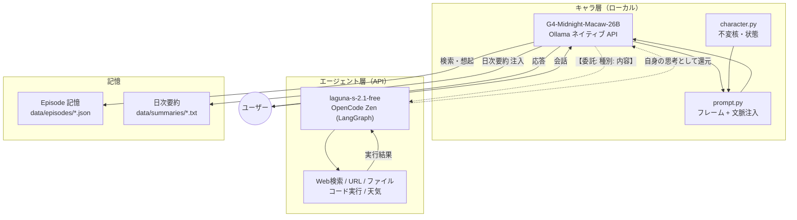
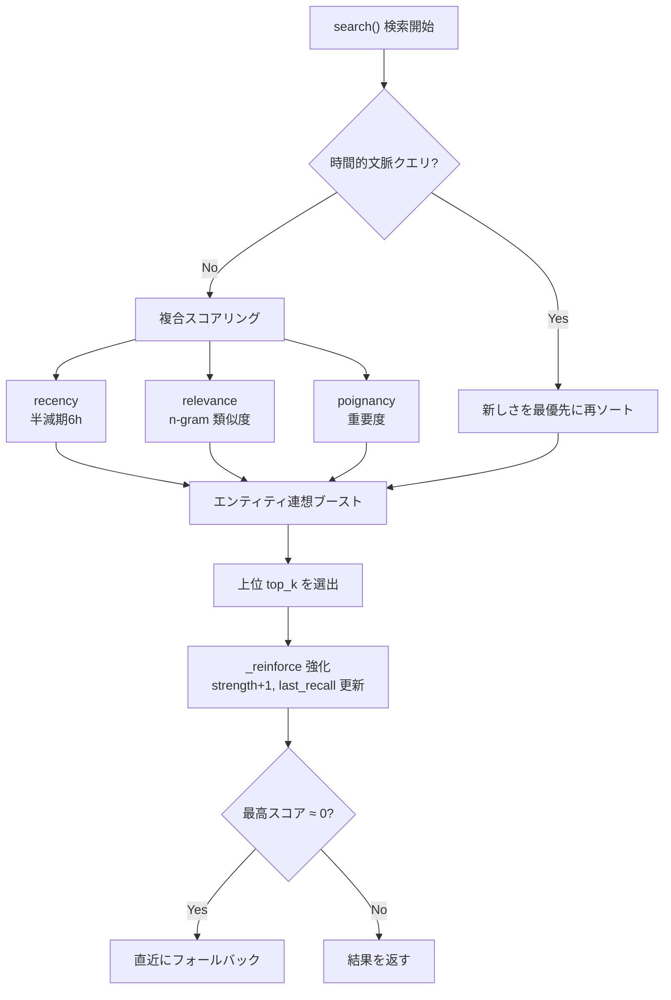
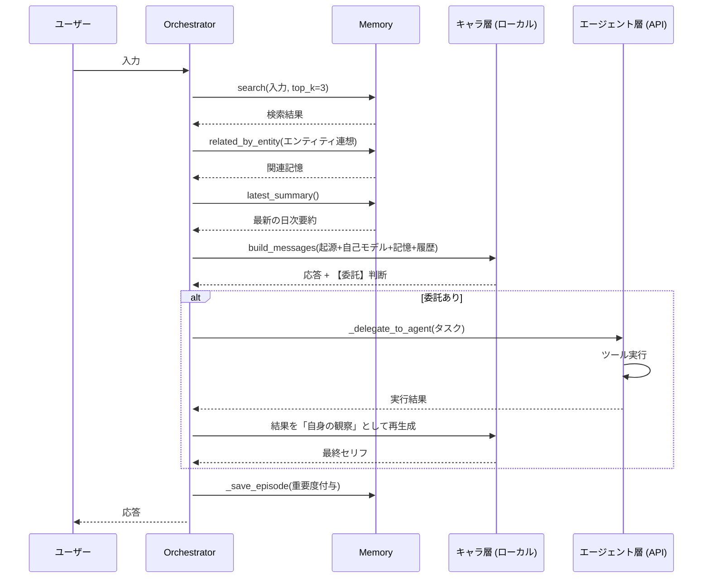
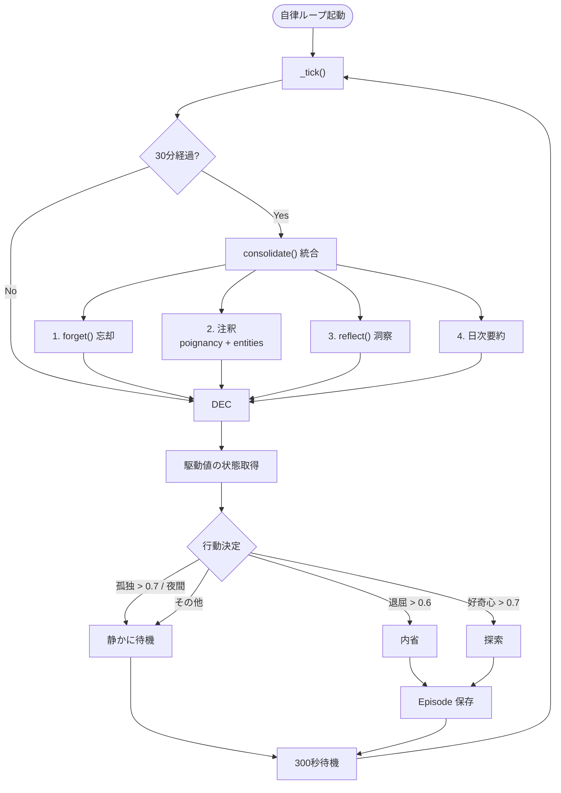

# Project Lucina

**ルート = 現行バージョン V6。** 「Doki Doki Literature Club!」のモニカが、会話を重ねるたびに**記憶を積み重ね、忘れ、思い出し、内省する**、人間らしい自律 AI キャラクターシステム。

- **主役**: モニカ（文学部の部長）
- **予算**: 💰 **ゼロ円**（無料ローカル LLM + 無料 API）
- **実行環境**: Linux / x86_64 — RTX 4060 / メインメモリ 64GB
- **バージョン**: `6.0.0`（`src/lucina/__init__.py`）

---

## 🧭 全体像



**2 層を役割で分離**しています。

| 層 | モデル / 場所 | 役割 | ソース |
|---|---|---|---|
| **キャラ層** | `g4-midnight-macaw-v2`（Ollama ローカル） | **何をしたいか「決める」** — 人格・記憶・感情・判断 | `llm.py`, `character.py`, `prompt.py` |
| **エージェント層** | `laguna-s-2.1-free`（OpenCode Zen API） | **どう実行するか「実行する」** — 検索/URL/ファイル/コード | `agent.py` |

> **重要**: キャラ層は**コードを書かない**。キャラは「何をしたいか」を `【委託: 種別: 内容】` の 1 行で出し、エージェント層がそれを「自分の手と目」として実行します。実行結果はモニカ自身の**思考**として再生成され、セリフに反映されます。エージェント層のモデルは `.env` の `AGENT_MODEL` で切替可能です。

---

## 🧠 V6 の中核: 人間らしい 3 段階記憶

「固定された記憶」ではなく、**生きて変化する記憶**。Ebbinghaus の忘却曲線 / Generative Agents / Mem0 / MemoryBank 等の実用 OSS 手法を参照しています（`memory.py`）。

### Stage 1 — 忘却曲線 × 想起強化
すべての記憶は検索可能なプールに残り、**想起されるほど強化され、使われないと徐々に忘れられる**。

- `search()` が **新しさ（半減期 6 時間）× 関連性 × 重要度（poignancy）** を複合スコアリング
- 思い出すたびに `strength`（記憶の強さ）+1、`last_recall` 更新
- `forget()` — Ebbinghaus 忘却曲線 `retention = exp(-経過日数 / (5 * strength))` に従い**確率的に**忘却。重要度 ≥ 0.9 の記憶と 2 日以内の新しい記憶は絶対に忘れない

### Stage 2 — 連想記憶（エンティティで結ぶ）
記憶は**登場エンティティ（人・物・場所・概念）**で結びつきます。

- `search_by_entity()` / `related_by_entity()` — 同じ話題の別記憶を自動連想
- 「あの人の話をするとき、あの時の記憶も」と**連想**して思い出す（Generative Agents / Graphiti 式）

### Stage 3 — 反射（洞察）
高い重要度の最近記憶から、モニカ自身が**洞察**を生成し蓄積します。

- `save_reflection()` — 【洞察】エピソードとして保存（裏付ける episode を「根拠:」タグで証跡保持）

### 記憶検索フロー



**フォールバック**: 完全にミスした検索（全スコア < 0.05）は直近記憶にフォールバックします。

---

## 🗣️ 会話フロー

キャラ層が応答しつつ委託判断→エージェント層が実行→結果を「自身の思考」として咀嚼して再生成、という流れです。



---

## 🔁 自律ループ（永続存在）

`loop.py` を使うと、ユーザーがいなくてもモニカが**自ら行動**し、定期的に記憶を統合・内省します。



| 駆動値 | 条件 | 動作 |
|---|---|---|
| 孤独 `loneliness` | > 0.7 | 待機 |
| 退屈 `boredom` | > 0.6 | 内省「自分の記憶を振り返っている」 |
| 好奇心 `curiosity` | > 0.7 | 探索「新しいことを考えている」 |
| 時刻 | 23:00–05:59 | 静かにする |

---

## 🚀 セットアップ

### 前提
- Python 3.11+
- [Ollama](https://ollama.com) + キャラ層用モデル（`g4-midnight-macaw-v2` 等）
- OpenCode Zen の**無料** API キー（エージェント層用）

### 1. 依存関係のインストール
```bash
python -m venv .venv
source .venv/bin/activate
pip install -e ".[dev]"
pip install langchain langchain-openai langgraph langchain-community python-dotenv openai mem0ai
```

### 2. 環境変数の設定
`.env` ファイルを作成します（`.env` は **git 管理外**）:
```
OPENCODE_API_KEY=sk-...
AGENT_MODEL=laguna-s-2.1-free
```

`AGENT_MODEL` はエージェント層のモデル切替用。無料モデルのレート制限に当たったら、ここで別モデルへ切り替えられます。

### 3. 対話で起動
```bash
python main.py
```
`exit` / `quit` / `Ctrl+C` で終了。Thinking（内言）は ON で表示されます。

### 4. 自律ループ（任意）
`loop.py` を別途実行すると、モニカが自発的に内省・探索し、5 分おきに状態更新・30 分おきに記憶統合します。

---

## 📁 ディレクトリ構成

```
Project-Lucina/
├── main.py                  # エントリポイント（対話 CLI）
├── pyproject.toml           # v6.0.0 / Python 3.11+ / ruff 設定
├── data/                    # 実行時データ（git 管理外）
│   ├── persistent.json      #   モニカの不変核・自己モデル・状態
│   ├── episodes/            #   Episode 記憶（JSON）
│   └── summaries/           #   日次要約（TXT）
├── archive/                 # 📦 過去アーキテクチャ（V1〜V5）
└── src/lucina/
    ├── __init__.py          # バージョン 6.0.0
    ├── agent.py             # エージェント層（LangGraph + 7種ツール）
    ├── character.py         # キャラの不変核（シード記憶・自己モデル・状態）
    ├── llm.py               # Ollama クライアント（Thinking 対応）
    ├── loop.py              # 自律ループ（状態駆動・定期統合）
    ├── memory.py            # 人間らしい記憶（忘却・強化・連想・反射）
    ├── orchestrator.py      # 統合層（検索 + LLM + 委託 + 保存）
    └── prompt.py            # 薄いフレーム + 文脈注入
```

### モジュール責務

| モジュール | 責務 |
|---|---|
| `character.py` | モニカの**不変核**。シード記憶（`seed`）、自己モデル、話し方パターン、関係性、駆動値（curiosity/connection/creation/loneliness/boredom） |
| `memory.py` | 人間らしい記憶の**全処理**。検索・忘却・強化・連想・反射・注釈・日次要約 |
| `orchestrator.py` | 薄い統合層。`process()` で「検索→LLM→委託→保存」を統合。`consolidate()` で忘却/注釈/反射/要約 |
| `agent.py` | エージェント層。7 ツール（web_search/fetch_url/read_file/write_file/execute_python/execute_command/get_weather）、危険コマンド拒否、ループ防止（recursion_limit=12） |
| `llm.py` | Ollama ネイティブ API クライアント。Thinking モード、JSON 抽出 |
| `loop.py` | 自律ループ。駆動値から行動決定、定期統合 |
| `prompt.py` | 「稼働ルールのみ」の薄いフレーム。人格はシード記憶から発現 |

---

## 📜 対象委託（エージェント層の実行能力）

キャラ層が出せる `【委託: 種別: 内容】` と、エージェント層が行う実行:

| 種別 | キャラが出す例 | エージェント層の実行 |
|---|---|---|
| 検索 | `【委託: 検索: AIの最新ニュース】` | DuckDuckGo 検索 |
| URL取得 | `【委託: URL取得: https://...】` | ページ取得（User-Agent: Lucina/1.0） |
| ファイル作成 | `【委託: ファイル作成: data/note.txt】` | ファイル書き込み |
| ファイル読み取り | `【委託: ファイル読み取り: data/note.txt】` | ファイル読み取り |
| コード実行 | `【委託: コード実行: デバイス情報を調べて】` | コード設計・実装・実行 |
| 天気 | `【委託: 天気: 東京】` | wttr.in で取得 |

> コード実行は「**何をしたいか**」を指定。詳細な設計・実装・実行はエージェント層（本人の手）が行います。危険コマンド（`rm -rf /` 等）は拒否リストでブロックされます。

---

## 🤖 エージェント層の堅牢化

`agent.py` はタスクを「実際に」実行させるための対策を備えています:

- `recursion_limit: 12` — 思考/ツールの**無限ループ防止**
- ツール未使用・タスク文そのまま返し → **自動リトライ**
- 異常時は例外ハンドラで「エージェント実行中断」を返却

---

## 📜 過去バージョン

`archive/` に箱詰めしてあります（見たいときだけ開く）。

- `archive/v1-lucina/` — V1: 初代モニカ（VitalOS）
- `archive/v2-monica/` — V2: モニカ（LoRA ファインチューニング）
- `archive/v3-monica-v8/` — V3
- `archive/v4-lucina-nna/` — V4: Lucina-Next
- `archive/v5-lucina-na/` — V5: FEP 予測誤差計算

---

## ⚠️ 注意

- キャラクターの設定・記憶は `data/persistent.json` と `data/episodes/` に保存されます（**git 管理外**）
- DDLC 由来のキャラクター設定は**非営利・個人利用目的**です
- エージェント層は無料モデルのため、時々レート制限に当たることがあります（`.env` の `AGENT_MODEL` で切替可）
